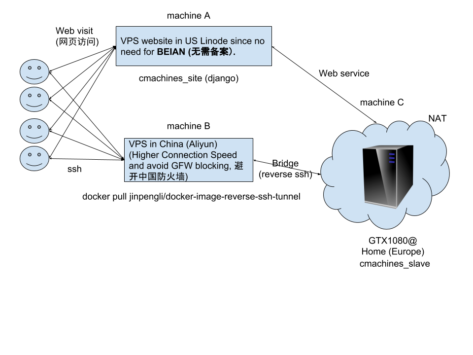

Introduction
============

This is a complex system for sharing gpu at home based on the docker containers. Each user works in the an independent container. See the on-line demo (http://cmachines.chongdata.com). 

This tutorial is NOT written for the beginners. I assume that you already knew the below techniques very well:

  * docker manipulation
  * btrfs configuraiton with docker
  * linux network configuration
  * django installation

Architecture
============

Before installing the gpu solution, you can have a look at the architecture as shown as below. Basically you need three machines
  * Machine A: vps for the website (`cmachines_site` in this project). Users will use this website to create machines or to modify machines. This website is written by django. Please goto [djangoproject](https://www.djangoproject.com/) to understand how to install the website.
  * Machine B: vps in China for the ssh connection. This machine is used for the ssh connection. The installation is very simple. You only need to install docker on this machine, and pull an image on this machine (`docker pull jinpengli/docker-image-reverse-ssh-tunnel`)
  * Machine C: This machine is usually located at your home. It canbe behind the NAT. The installation is very complex, and the source is located in `cmachines_slave` in this project. You can read the README.md for the installation.

Network configuration
---------------------

Since the "Machine C" will create containers on the "Machine B", you need to add the ssh pub key of "Machine C" on the "Machine B". Make sure that you can connect to the "Machine B" from "Machine C" without using the Password.

Questions
==========

If you have question, please open a issue. If I have time, I will answer it otherwise I will leave it open. Sorry for opening issues since I have so much work to do, but I am motivated to create new projects. Thanks in advance.

